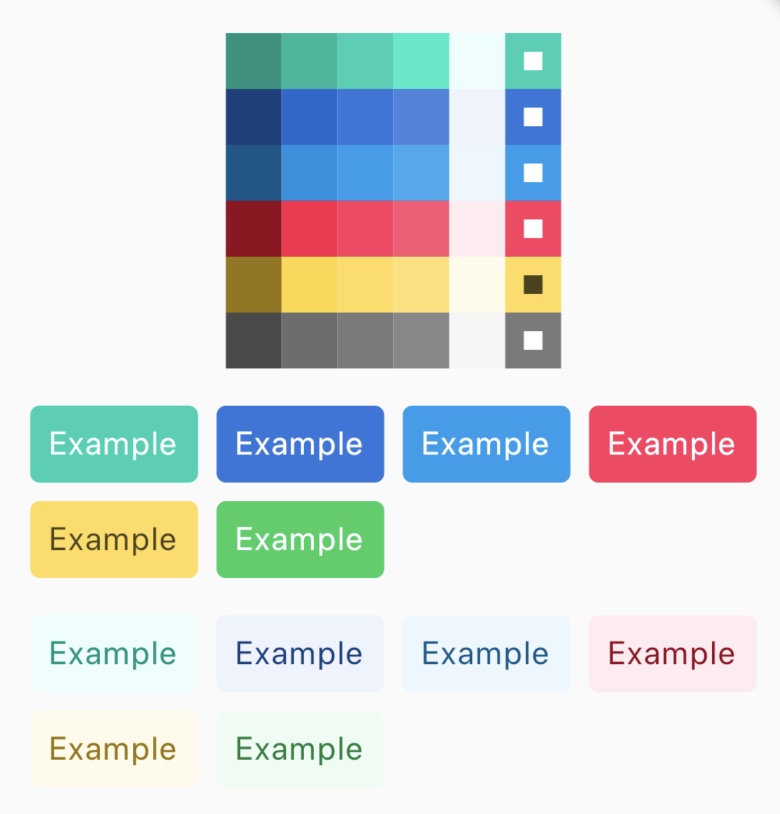

# derived_colors



Generate color variants.

## Usage

```dart
import 'package:derived_colors/derived_colors.dart';

final color = Color(0xFFFF0000);
final light = color.variants.light;
final dark = color.variants.dark;
final invert = color.variants.invert;
final invert = color.variants.invert;

final hoverColor = color.derive();
```

## Thanks

* [Bulma](https://bulma.io/) : inspired by Bulma's calculations.